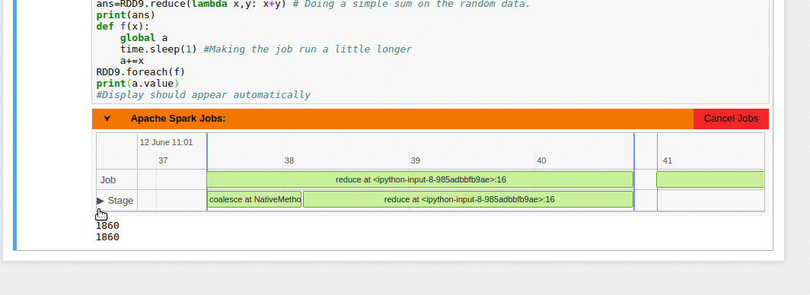

# Spark Monitor Extension for Jupyter Notebook
## Work in Progress

## Notes
* This version uses a python based `SparkListener` attached to the `SparkContext`. (Scala listeners coming soon)
* The extension requires the user to call `connectContext(sc)` after the context is created, from the notebook to start working (Requirement will be removed in future)
 * ```python
   from sparkmonitor import sparkmonitor
   sparkmonitor.connectContext(sc) #sc - SparkContext
   ```

## Installation

For development purposes the extension folders are symlinked to the appropriate directories. This way making changes is easier.

First clone the repository and switch to it.

```bash
git clone https://github.com/krishnan-r/sparkmonitor/
cd sparkmonitor/extension
```

#### Front End Extension
The frontend extension is symlinked (```--symlink```) into the jupyter configuration directory in the python prefix path using (```--sysprefix```) by `jupyter nbextension` command. The second line configures the frontend extension to load on notebook startup.

```bash
jupyter nbextension install ./frontend/spark_monitor --sys-prefix --symlink
jupyter nbextension enable spark_monitor/module --sys-prefix
```

#### Kernel Extension
The ipython kernel extension has to be put in a directory which is importable by python code.
Here we symlink the folder into the ipython extension directory.

```bash
ln -s ./extension/kernelside/sparkmonitor/ ~/.ipython/extensions/sparkmonitor
```

Create the default profile configuration files (Skip if file already exists)
```bash
ipython profile create
```
Configure the kernel to load the extension on startup. This is added to the configuration files in users home directory
```bash
echo "c.InteractiveShellApp.extensions = ['sparkmonitor.sparkmonitor']" >> ~/.ipython/profile_default/ipython_kernel_config.py 
```
